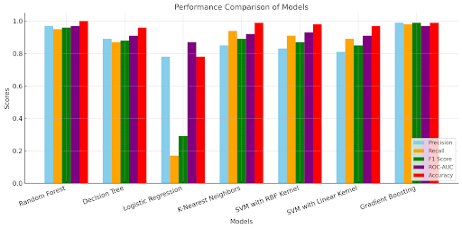

Network Intrusion Detection System (NIDS)
This project is an implementation of a Network Intrusion Detection System (NIDS) using machine learning models to detect malicious activity in network traffic. The system analyzes network packets, classifies them into normal or malicious categories, and uses a variety of tools including Streamlit for the user interface and Flask for a backend API.

Project Structure

```
/app
|-- /visualization        # Visualizations and data analysis scripts
|-- /notebooks            # Jupyter notebooks for experimentation and analysis
|-- /models               # Directory where trained models are stored
|-- /packets              # Folder for packet sending/receiving scripts
|-- /streamlit            # Streamlit app directory for real-time interaction
|-- /flask                # Flask API directory for backend interaction
|-- README.md             # Project documentation
```

Directories Overview
/visualization: This directory contains scripts for visualizing the data, analyzing feature importances, and plotting results from the machine learning models.
/notebooks: Contains Jupyter notebooks where you can find experiments related to the dataset, preprocessing steps, model evaluation, and hyperparameter tuning.
/models: All trained machine learning models are stored here. You can load them and use them for predictions or deploy them using the Streamlit app or Flask API.
/packets: This directory includes Python scripts that mimic a small packet transfer between sockets, simulating real-world network activity. The system uses this to demonstrate how the trained model can detect packets being transferred over the network.
/streamlit: This is the user-facing directory containing a Streamlit app for real-time interaction. Users can test the model by providing sample packets and receiving predictions on whether they are normal or malicious.
/flask: A backend Flask API that allows users to interact with the trained model through HTTP requests. This is useful for integrating the NIDS with other systems or creating a simple interface to use the model in production.
Features

Real-time Prediction: With the Streamlit app, you can interact with the model and make predictions on real-time network packets.
Flask API: A RESTful API for sending network data and receiving predictions, making the model accessible for other applications.
Model Evaluation: The project contains multiple models trained using different algorithms (like SVM, GradientBoosting) with performance evaluation using accuracy, classification reports, and confusion matrices.
Visualization: Visualize data distributions, feature importances, and model results to understand the patterns in network traffic.
Packet Simulation: The packets folder contains Python scripts that simulate the sending and receiving of packets between a sender and receiver. The model classifies whether the packet is benign or malicious during this process.
How It Works
The NIDS workflow is as follows:

Data Preparation: Network data (from KDDCup 1999 dataset or any custom dataset) is loaded and preprocessed. Features are selected and encoded for training.

Model Training: Several machine learning models (like Support Vector Machine and Gradient Boosting) are trained to classify network traffic into two categories: Normal and Malicious.

Packet Transfer Simulation: The packets folder contains two scripts: one for the packet sender and one for the receiver. The sender simulates network traffic by sending packets, and the receiver uses the trained model to predict whether a packet is benign or malicious.

Flask API: The Flask API serves as a backend for sending and receiving packet data, offering a RESTful interface for integration with other systems.

Streamlit App: The Streamlit app provides a simple user interface to upload sample packets and get real-time predictions from the model.

Installation
Prerequisites
Make sure you have Python 3.7+ installed. Additionally, the following dependencies are required:

pandas
numpy
scikit-learn
flask
streamlit
matplotlib (for visualization)
seaborn (for visualization)
You can install all dependencies by running:

```
pip install -r requirements.txt
```

Running the Streamlit App
Run the following command to start the app:

```
streamlit run app.py
```

This will launch the app in your browser, where you can interact with the model, upload packets, and get predictions.

Running the Flask API
Navigate to the /flask directory.
Run the following command to start the Flask server:

```
python main.py
```

This will start a local server at http://127.0.0.1:5000. You can send POST requests with packet data to get predictions from the model.


Simulating Packet Transfer
Navigate to the /packets directory.
Run the sender.py script to send packets:

```
python sender.py
```

In a separate terminal, run the receiver.py script to simulate receiving packets and getting model predictions:

```
python receiver.py
```

Model Loading and Evaluation
You can evaluate the models stored in the /models directory by loading them and making predictions on new data. You can also visualize the feature importances and evaluation metrics in the /visualization directory.

Example Usage
Streamlit App: Upload a sample packet (in the correct format) to get a prediction of whether it's normal or malicious.
Flask API: Send a POST request with packet data (e.g., a JSON payload with packet features) to receive predictions on packet integrity.
Packet Transfer: Run the sender and receiver scripts to simulate a network scenario, and see how the model detects malicious packets in real-time.
Project Workflow
Data Preprocessing: The raw network data is processed to remove irrelevant features, handle missing values, and encode categorical variables.
Model Training: Multiple machine learning algorithms are trained using scikit-learn, including Gradient Boosting and Support Vector Machines (SVM).
Deployment: The trained models are deployed in two ways:
Through a Streamlit app for real-time user interaction.
Through a Flask API for backend integration or third-party access.
Simulation: The packet transfer simulation helps showcase how the model works in a real-world context by mimicking network activity.

Quick Overview 


Model Performance 
